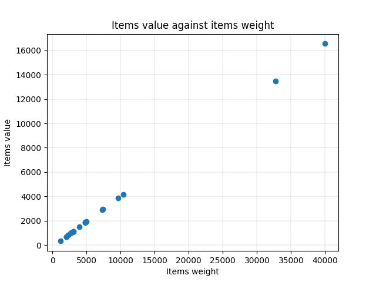
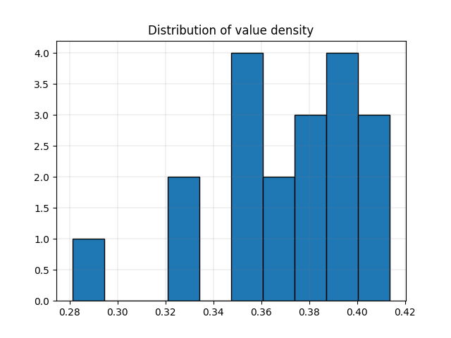

# Knapsack

**Table of contents**
1. [Problem formulation](#problem-formulation)
2. [Optimization methods](#optimization-methods)
3. [Detailed example](#detailed-example)

<a id="problem-formulation"></a>

## 1. Problem formulation
In the knapsack problem, users must select items among a list of n items in such way that:
- the total value of selected items is maximized
- the total weight of selected items does not exceed the knapsack capacity

Let:
- *n* be the number of items available
- *K* the knapsack capacity
-  the value of item i
-  the weight of item i

The problem can be formulated mathematically as:

*Maximize:*


*Subject to:*

- 
- 

<a id="optimization-methods"></a>

## 2. Optimization methods

### 1. Greedy algorithm
A first approach to solve the knapsack problem is to implement a greedy algorithm. There is no guarantee that the algorithm will reach the optimal solution but it can be used to established a baseline that can then be improved with more sophisticated methods.

The greedy algorithm implemented in the repository follows these steps:
- Items are sorted in descending order by value density (i.e. items with the most value per unit of weight come first).
- User adds items to the knapsack by following the order defined in the previous step.
- The algorithm ends when no remaining item can fit in the knapsack.

### 2. Branch and bound
In the repository, we implement a branch and bound algorithm to find the set of items that will maximize the knapsack value. In this approach, we first solve the problem as a linear programming problem by relaxing the integrality constrainsts.

Just like with our greedy algorithm, we sort the items by descending value density. For each item, we compute the best value we could obtain if we did not have integrality constraints. If the best estimate of selecting this item exceeds the current best solution, we keep exploring this part of the tree. Otherwise, we prune the tree and explore another branch. 

### 2.1 Branch and bound steps
1. Remove a node from the queue
2. Expand its 'left child' (next item in the list is selected), and compute its value, remaining capacity and bound.
3. If 'left child' solution does not exceed capacity and its value is greater than the current solution's best value, update current best solution.
4. If its bound is greater than current best solution, add 'left child' to the list of nodes to explore.
5. Explore 'right child' (next item in the list is not selected), and compute its bound.
6. If its bound is greater than current best solution, add 'right child' to the list of nodes to explore.
7. Go back to step 1 until the queue is empty.

### 2.2 Tree exploration variants
There are several ways of exploring the search tree. This repository provides an implementation of the branch and bound with breadth-first, depth-first and best-first search methods.
#### 2.2.1. Breadth first search
In this variant, the algorithm prefers to expand all nodes of a given level before proceeding the the next level.
#### 2.2.2. Depth first search
In this variant, the algorithm will expand the nodes as deeply as possible before moving to another branch.
### 2.2.3. Best first search
In this variant, the algorithm will expand the nodes with the highest bound first.

<a id="detailed-example"></a>

## 3. Detailed example
This section is a walkthrough of the process to solve the knapsack problem. It uses the input file ks_19_0.

### 3.1. Data overview
There are 19 items to choose from. In addition to the value and weight of each item, we compute the 'density' of the item (i.e. the value per unit of weight). The data is represented in the table below.

|   index |   value |   weight |   density |
|--------:|--------:|---------:|----------:|
|       0 |    1945 |     4990 |  0.38978  |
|       1 |     321 |     1142 |  0.281086 |
|       2 |    2945 |     7390 |  0.398512 |
|       3 |    4136 |    10372 |  0.398766 |
|       4 |    1107 |     3114 |  0.355491 |
|       5 |    1022 |     2744 |  0.372449 |
|       6 |    1101 |     3102 |  0.354932 |
|       7 |    2890 |     7280 |  0.396978 |
|       8 |     962 |     2624 |  0.366616 |
|       9 |    1060 |     3020 |  0.350993 |
|      10 |     805 |     2310 |  0.348485 |
|      11 |     689 |     2078 |  0.331569 |
|      12 |    1513 |     3926 |  0.38538  |
|      13 |    3878 |     9656 |  0.401616 |
|      14 |   13504 |    32708 |  0.412865 |
|      15 |    1865 |     4830 |  0.386128 |
|      16 |     667 |     2034 |  0.327925 |
|      17 |    1833 |     4766 |  0.384599 |
|      18 |   16553 |    40006 |  0.413763 |

The density variable matters because dense items are more likely to be part of the optimal solution. The greedy algorithm implemented in the repository selects these dense items first until there is no more space available in the knapsack.

Let's visualize value of each item against their weight (see scatterplot below). Some observations:
- two items (indexes 14 and 18) have a significantly greater value (>13,000) and weight (>30,000) than the rest of items, where values never exceed 5,000 and weights are under 12,000. With a knapsack capacity of 31,181, neither item can be part of the solution.
- the density of all items seem pretty close as all points are distributed on a straight line.



Let's visualize the distribution of value density. Density ranges from .28 to .41, with most items concentrated around .39 (+- .02). Two items are unlikely to be selected due to low density but it is not yet sure that neither is part of the optimal solution.



### 3.2. Filling the knapsack

**a. Greedy algorithm**

Before we try to find the optimal solution, let's start with finding a feasible solution to establish a baseline that we can build on. We will use a greedy algorithm that sorts items per density in a descending order and selects them one by one until no item can fit in the knapsack.

```
import read_inputs as inp
import heuristics as hr

data = inp.read_file(file_name)

# solve problem
baseline = hr.solve_greedy(data[2], data[1])
print(f'Greedy algorithm reached a value of {baseline[1]} with the following items: {baseline[0]}')

# Output: Greedy algorithm reached a value of 11981.0 with the following items: [0, 0, 1, 1, 0, 1, 0, 0, 0, 0, 0, 0, 0, 1, 0, 0, 0, 0, 0]
```
The greedy algorithm reached a solution of 11,981 by selecting items 2,3, 5 and 13. There is no guarantee that this solution is optimal but we now have a value to use as a reference.

**b. Branch and bound algorithm**

We will now use our branch and bound function to find the optimal solution. It will run much slower than the greedy algorithm as it will explore a much larger share of the search space but will find the best solution to the problem.

```
import read_inputs as inp
import heuristics as hr

data = inp.read_file(file_name)

# solve knapsack with branch and bound
solved = bb.solve_bb(data[2], data[1], 'best')
print(f'Branch and bound algorithm reached a value of {solved[1]} with the following items {solved[0]}')

# Output: Branch and bound algorithm reached a value of 12248.0 with the following items [0, 0, 1, 0, 0, 1, 0, 1, 0, 0, 0, 0, 1, 1, 0, 0, 0, 0, 0]
```
With an optimal value of 12,448, the branch and bound method improved our previous solution by 2.23%.
